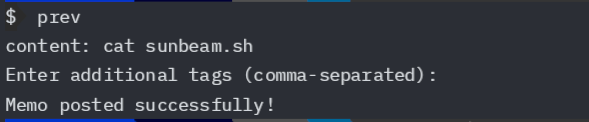
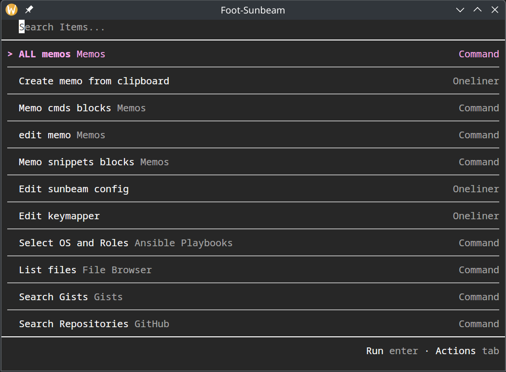

# Memo Scripts

Sunbeam memo extension and golang script to add, read and edit memo entries via the command line.

## Why

* I needed an easy way to save rarely used commands, useful when working from multiple systems (work and personal computer)
* save links/bookmarks or informaion to read later

## Features
* add memo entries from clipboard
* add memo entries from the command line
* The cmd filtered entries will only copy the value in the code block.  So it can be copied to the clipboard and pasted into a terminal

## Pre-requisites

1. Memo server https://www.usememos.com
2. Sunbeam https://sunbeam.pomdtr.me
3. Golang https://go.dev

## Installation

1. Install the script using go get:
```bash
go get github.com/smetroid/memo-scripts
```
2. Add function to your shell configuration file (e.g., ~/.bashrc, ~/.zshrc):
```bash
function prev() {
  ~/projects/memo-scripts/memo-scripts -shellCommand
}
```
3. Install sunbeam extension
```bash
make sunbeam-install
```
4. Configure the sunbeam extension by adding the following to your sunbeam config file:
```yaml
extensions:
  memo:
    url: https://your-memo-server.com
    token: your-memo-token
```

or enter the memo url and token when prompted

## Usage

### CLI

1. To save a cli command to memo:
```bash
  prev
```
2. Enter additional tags to go with the command (not required)
eg:
```bash
$ prev
content: ./memo-scripts -help
Enter additional tags (comma-separated):
```
3. **enter** to save entry to memo server \



### Clipboard

#### Pre-requisites

1. MacOS/Linux
    1. You must have Sunbeam [terminal integration](https://sunbeam.pomdtr.me/docs/user-guide/integrations.html#terminals), alacritty or hyper
1. Linux - less resources
    1. Foot terminal with zsh shell
    2. Use linux to create a shortcut to toggle terminal

#### Usage

1. Start hyper or alacritty via the shortcut/hotkey
2. You should see an option to create a memo entry from Clipboard



### Raycast

*Note:* sunbeam does provide a raycast extension, but was not able to get it working so this is a workaround

#### Pre-requisites

1. alacritty

#### Usage

1. Setup a raycast shortcut to run the raycast-alacritty.sh script

### Todo

- [ ] Implement delete memo functionality
- [x] Binary downloads for the scripts
- [ ] Need to remove the #cmd tag from a memo entry if it's created via clipboard
- [ ] alacritty json config file
- [ ] Go routine to get all memo entries, for faster retrieval of memo items
- [ ] add creating a new memo via sunbeam (only terminal and clipboard works)
